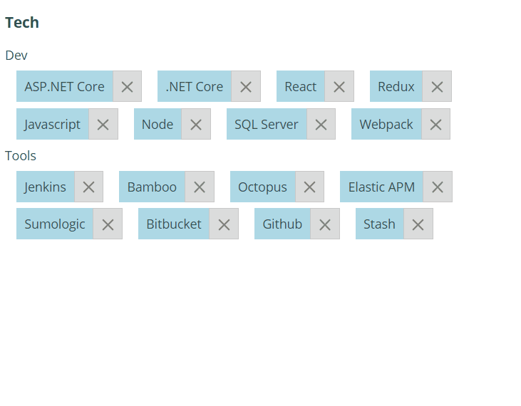

## React Autocomplete Tags Input
A simple React component for displaying an editable list of tags with autocompletion for adding more tags.
This is inspired by the Components field editor in Jira.

## Features
- Display list of tags and allow user to add and delete tags
- Supply list of allowed tags that user can select from when adding to the list
- Simple interface

### Coming Soon
- Reorder feature
- Ability for user to create new tags (outside of the allowed list) and add them to the list

## Demo
Here is a simple demo which allows you to choose from a number of available programming languages and development tools.


## Installation
The package can be installed via npm
```
npm install @jchristou/react-autocomplete-tags-input
```

You will need to install React and React-Dom separately (peer dependencies).

The default styling is not automatically included. To include it please import it
```js
import '@jchristou/react-autocomplete-tags-input/dist-component/style.css';
```

## Usage
See the [example project](https://github.com/jameschristou/react-autocomplete-tags-input/tree/master/example)

## Development
Run `npm install` to install all packages and depenedencies.

### Dev
To compile front end assets while developing use `npm run start`.

### Production
`npm run build`

### Analysis
`npm run build:analyze` builds static analysis to examine bundle sizing. You can see output reports in dist/stats.html and dist/report.html
then use http-server to run a http server and access the stats.html. Just run `http-server dist` (ensure you have http-server installed globally)
the dist parameter ensures that it uses the dist folder. It will give you an IP address e.g. http://172.17.126.81:8080 then you can access
stats.html using http://172.17.126.81:8080/stats.html.